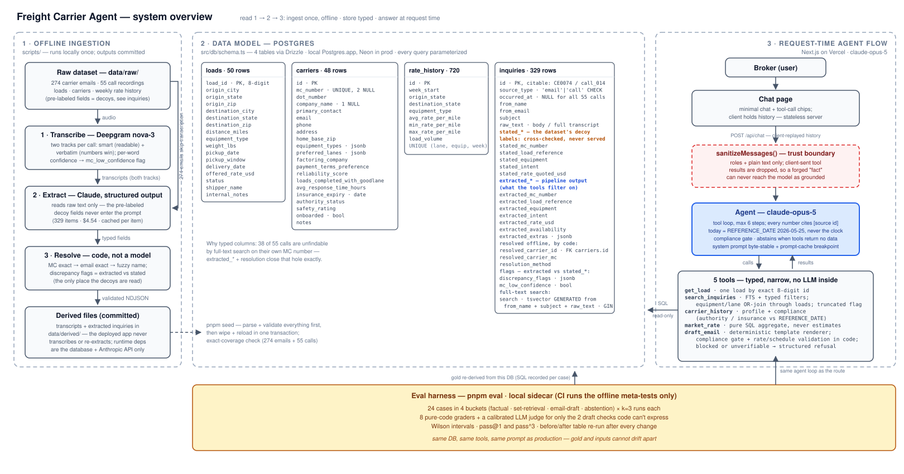

# freight-assistant

An AI intake agent for a freight brokerage: it answers questions over carrier
emails, call transcripts, loads, and market rates — with citations, a
compliance gate, and measured abstention. Built as the Goodlane founding-
engineer take-home.



## How to run

```bash
pnpm install
cp .env.example .env          # fill in DATABASE_URL + ANTHROPIC_API_KEY
pnpm db:push && pnpm seed     # schema + committed dataset -> Postgres
pnpm dev                      # chat UI at localhost:3000
pnpm typecheck && pnpm lint && pnpm test   # 260 tests; CI runs the same
pnpm eval --dry-run           # eval harness structure, no API calls
```

The dataset ships committed (`data/raw/` originals, `data/derived/` pipeline
outputs), so seeding needs no API keys and no network beyond Postgres.

## Decisions (each has an ADR or measured evidence)

| Decision | Why | Where |
| --- | --- | --- |
| Postgres + FTS, no vector DB | 329 short structured docs don't need ANN; typed columns beat embeddings for identifiers — measured: 38/55 calls are unfindable by FTS on their own MC number, which is the argument for extraction into typed columns, not against Postgres | `docs/decisions/002-no-vector-db.md` |
| Offline ingestion, committed outputs | transcribe → extract → resolve runs once, offline; request time only ever queries Postgres. Reviewable, diffable, re-runnable per id (`pnpm re-extract --ids CE0027`) | `docs/decisions/001-transcription-deepgram.md`, `scripts/` |
| Pre-labeled dataset fields treated as decoys | 145 emails carry a `stated_mc` with no MC in the body; extraction trusts raw text only, stores labels as `stated_*` for discrepancy flags | `CLAUDE.md`, `scripts/resolve.ts` |
| Frozen clock | "Today" is `REFERENCE_DATE` (2026-05-25); the agent never reads the wall clock (`new Date(x)` appears only to parse caller-supplied date strings), so answers are reproducible and citable | `src/lib/config.ts` |
| Eval harness as the arbiter | Error analysis first (40 traces, 6 failure modes), code/judge grader split, judge calibrated against 20 hand-labeled items with TPR/TNR + kappa; Wilson CIs on the headline pass rates | `docs/decisions/003-eval-design.md`, `evals/` |
| LLM-judge determinism without temperature | opus-5 rejects temperature; determinism is claimed via measured repeat-stability (12/12 unanimous) and a leakage-ratchet test after a real calibration-contamination catch (judge v2 retracted, v3 promoted) | `docs/decisions/004-judge-determinism.md`, `evals/judge/versions.md` |

## Eval results (the emphasized deliverable)

Baseline vs post-fix, 24 cases x k=3, all graded by the same graders + judge
v3 (`evals/before-after.md` for the full story):

| | baseline | post-fix |
| --- | --- | --- |
| run-level | 51/72 (70.8%) | 52/72 (72.2%) |
| pass@1 | 17/24 | 17/24 |

The targeted fix verified (L05 equipment-blindness: 0/3 → 3/3) while set
retrieval *transformed* rather than improved — recall reached 1.0 on 15 of
18 set-retrieval runs while precision dropped (spurious items); S06 remains
a recall failure — a trade only a set-F1 grader could see. Model
comparison (same harness, post-fix):

| model | pass@1 | est. cost/query |
| --- | --- | --- |
| claude-opus-5 (shipped) | 70.8% | $0.121 |
| claude-sonnet-5 | 62.5% | $0.061 |
| claude-haiku-4-5 | 29.2% | $0.008 |
| gpt-5.6-luna | 25.0% | $0.0026 |

Set retrieval fails for **every** model — 3/18 runs pass on each Claude tier,
0/18 on Luna — so the remaining weakness is task-level, not model-level. Sonnet-vs-opus is statistically unresolved at
n=24 (overlapping Wilson intervals); the harness makes promoting sonnet a
cheap experiment rather than an opinion. Cheap tiers fail on *thoroughness*
(haiku answers abstention questions with zero tool calls), which is invisible
in fluent prose.

## What I'd improve next

1. **Set-query precision**: prompt-side intersection guidance (availability
   intent x equipment x lane) + tool pagination — verified by the same
   before/after table that caught the flip.
2. **Name-keyed carrier lookup**: `carrier_history` is MC-keyed, so null-MC
   carriers are unreachable (the agent abstains rather than fabricates —
   measured by case A05 — but it should just find them).
3. **Chat persistence**: history is client-held and server-sanitized (tool
   parts are stripped as untrusted); server-side sessions would restore
   cross-turn tool context safely.
4. **Prompt-injection case in the eval suite**: inbound carrier text is
   untrusted input; the suite states this limit today instead of measuring it.
5. **Cheaper judge**: the judge runs on opus-5 for calibration-history
   reasons; re-calibrating a sonnet judge is ~$2 and the decision framework
   (measure, then promote) is already built.

Every PR in this repo carries an adversarial review triage table
(Codex CLI reviewer, findings verified before accepting — see PR #4 for the
judge-contamination catch and PR #1 for the seed data-loss catch).
